# Live Member Face Detection
## Project Description
This project was inspired by my experience waiting in long lines to have my season pass scanned at a ski resort. I realized there had to be a more efficient way to verify memberships and grant access to members without unnecessary delays. The same issue exists in places like Costco, sporting events, and other venues where long queues form just to validate entry credentials.
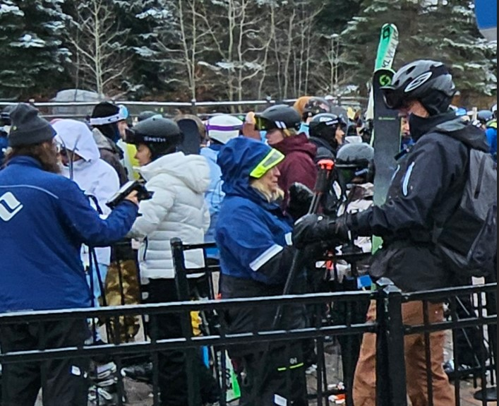

## Project Proposal
To solve this problem, I developed a real-time face recognition system using computer vision. <br>
The goal is to eliminate long wait times by allowing members to gain access seamlessly through facial recognition, reducing the need for manual verification. <br>

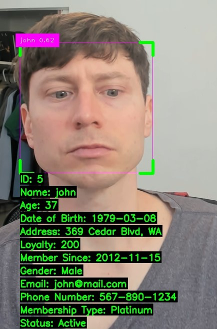

### System Overview
This system leverages sqlite to develop a members database, OpenCV, Ultralytics' for YOLO for object detection, and LBPHFaceRecognizer for real-time face recognition.<br>
By implementing this solution, venues such as ski resorts, retail stores, and stadiums can enhance customer experience by providing frictionless, secure, and efficient entry for their members.
### Table of Contents  
- [Setting up the SQLite Database](#setting-up-the-sqlite-database)  
- [Acquiring Video & Splitting Videos into Still Images](#acquiring-video--splitting-videos-into-still-images)  
- [Building YOLO Model](#building-yolo-model)  
- [Building LBPHFaceRecognizer](#building-lbphfacerecognizer)  
- [Future Implementations](#future-implementations)  
### Setting up the SQLite Database
Before creating the SQLite database, I needed to gather volunteers for my LMFD project.<br>
After reaching out to friends and family, I enlisted 12 volunteers, each assigned a unique ID.
##### Member List  

| Name      | ID Number |
|-----------|----------|
| Angela    | 1        |
| Classmate | 2        |
| Giuliana  | 3        |
| Javier    | 4        |
| John      | 5        |
| Maite     | 6        |
| Mike      | 7        |
| Ron       | 8        |
| Shanti    | 9        |
| Tom       | 10       |
| Vilma     | 11       |
| Will      | 12       |
#### Storing Data
For each volunteer, I generated synthetic data to store 15 different demographic attributes. <br> This data was randomly created and represents the type of information that potential members might have.
The Members database consisted of the following:
### Members Database

| Column           | Column Type         |
|------------------|---------------------|
| id               | INTEGER PRIMARY KEY |
| name             | TEXT                |
| age              | INTEGER             |
| date_of_birth    | TEXT                |
| address          | TEXT                |
| loyalty          | INTEGER             |
| member_since     | TEXT                |
| gender           | TEXT                |
| email            | TEXT                |
| phone_number     | TEXT                |
| membership_type  | TEXT                |
| status           | TEXT                |
| occupation       | TEXT                |
| interest         | TEXT                |
| marital_status   | TEXT                |
### SQlite Database Format
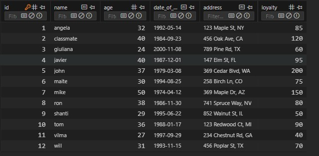
### Acquiring Video & Splitting Videos into Still Images 
I asked all 12 of my volunteers to send me an approximately 30-second video of their face. <br>
I suggested that they capture a variety of angles to help the YOLO and LBPHFaceRecognizer models learn different aspects of their facial features.<br>
For example, the video should include their face looking directly at the camera, as well as other angles.
[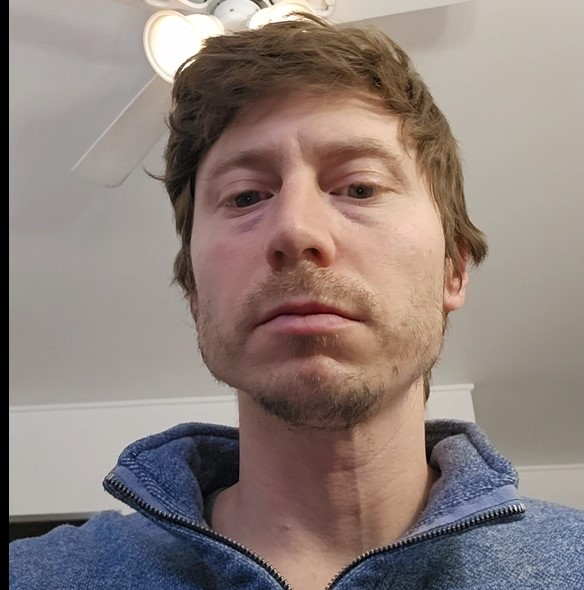](images/johns.mp4)
#### Extracting Frames from Video
I wrote Python code to extract approximately 100 images from each volunteer's video. Each volunteer's images were stored in a separate folder, with each folder containing unique, randomly selected frames.
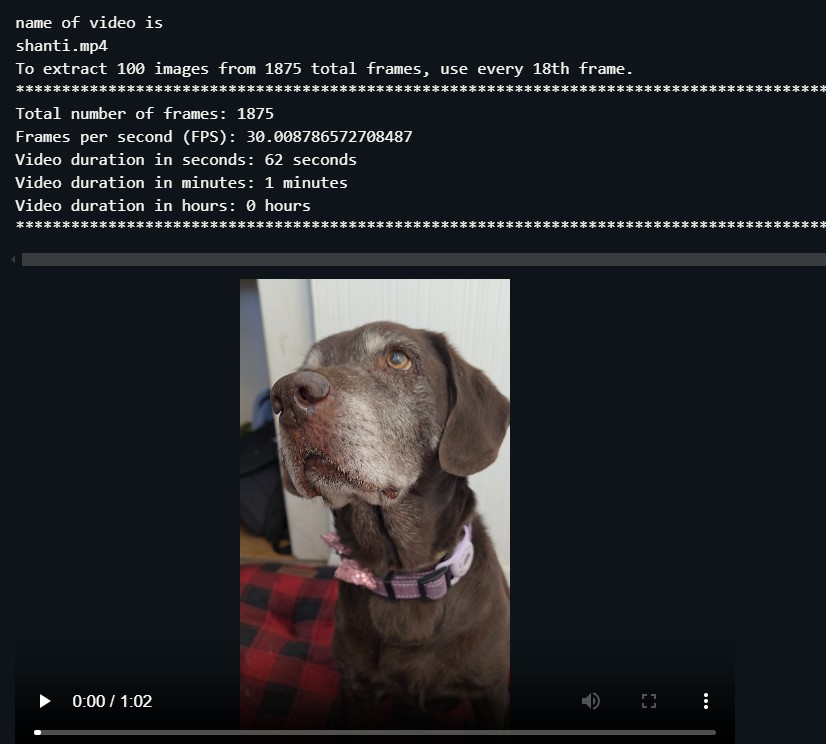
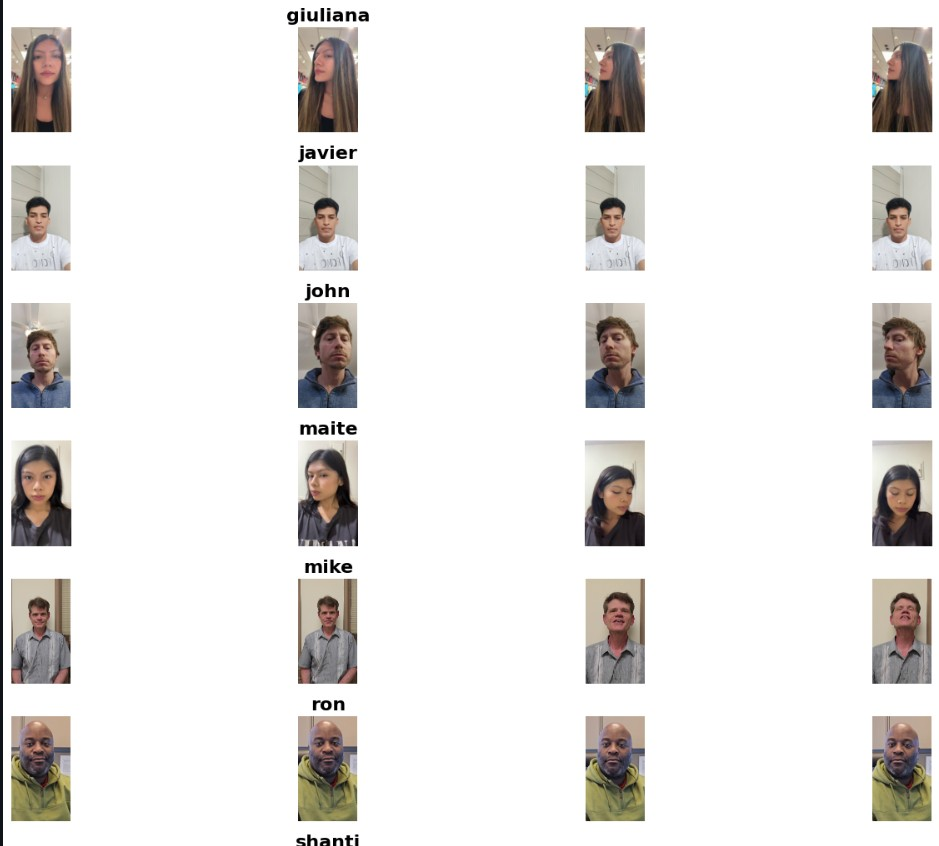
### Building YOLO Model 
To prepare the images for the YOLO v8 object detection model, I used OpenCV to detect faces within the images. Specifically, I employed the Haar Cascade classifier, an algorithm widely used for object detection, especially for faces. Once a face was detected, I generated a `.txt` file containing the volunteer's ID, the `x_center`, `y_center`, `width`, and `height` of the detected face.

I created a Python function that:

- Splits the images into training, validation, and test sets according to specified split ratios.
- Generates YOLO-formatted `.txt` annotation files for each image by detecting faces.
- Copies both the images and annotation files into their corresponding output folders.
- Finaly, data.yaml file linked the path,train,validation, number_of_classes

The folder structure for the output is as follows:
```bash
output_base/
    ├── train/
    │   ├── images/
    │   └── labels/
    ├── valid/
    │   ├── images/
    │   └── labels/
    └── test/
        ├── images/
        └── labels/

        
```
# Dataset Paths and Configuration
```yaml
path: /content/drive/MyDrive/capstone project/my_data_split
train: /content/drive/MyDrive/capstone project/my_data_split/train/images
val: /content/drive/MyDrive/capstone project/my_data_split/val/images
test: /content/drive/MyDrive/capstone project/my_data_split/test/images
nc: 12
names: ['angela', 'classmate', 'giuliana', 'javier', 'john', 'maite', 'mike', 'ron', 'shanti', 'tom', 'vilma', 'will']
```
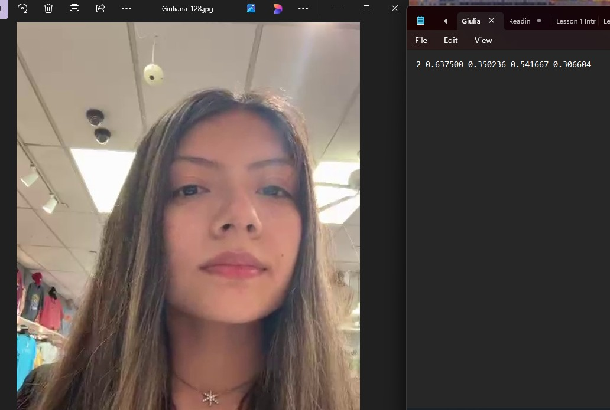
### Building the YOLO Model
I used the Ultralytics package to build the Yolo v8 model <br>
`!yolo task=detect mode=train model=yolov8l.pt data="/content/drive/MyDrive/capstone project/data.yaml" epochs=50 imgsz=640`

- Overall Model Performance
* mAP@50: 74.5% → On average, the Yolo v8 model detects objects correctly 74.5% of the time at an IoU threshold of 0.50.
* mAP@50-95: 66.7% → A more stringent metric, showing performance across multiple IoU thresholds.
* Precision (P): 0.74 → Out of all detected objects, 74% were correctly classified.
* Recall (R): 0.738 → The model correctly detected 73.8% of the total ground truth instances.
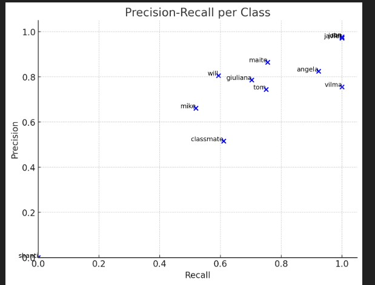
## Strongly Performing Classes

- **Javier, John, Ron**:  
  They have near-perfect precision and recall, meaning they are detected correctly almost all the time.

- **Angela, Giuliana, Maite, Vilma**:  
  These classes also show strong performance with high recall and mAP scores.

## Weakly Performing Classes

- **Shanti (P: 0, R: 0, mAP@50: 0.0082)**:  
  Your model is failing to detect this class altogether. You might need more data or better annotations.

- **Classmate (mAP@50: 0.425, P: 0.516, R: 0.61)**:  
  Struggles with precision and recall, meaning many false positives and false negatives.

## Moderate Performance

- **Mike, Tom, Will**:  
  These classes have mid-range scores, suggesting inconsistency in detection.

  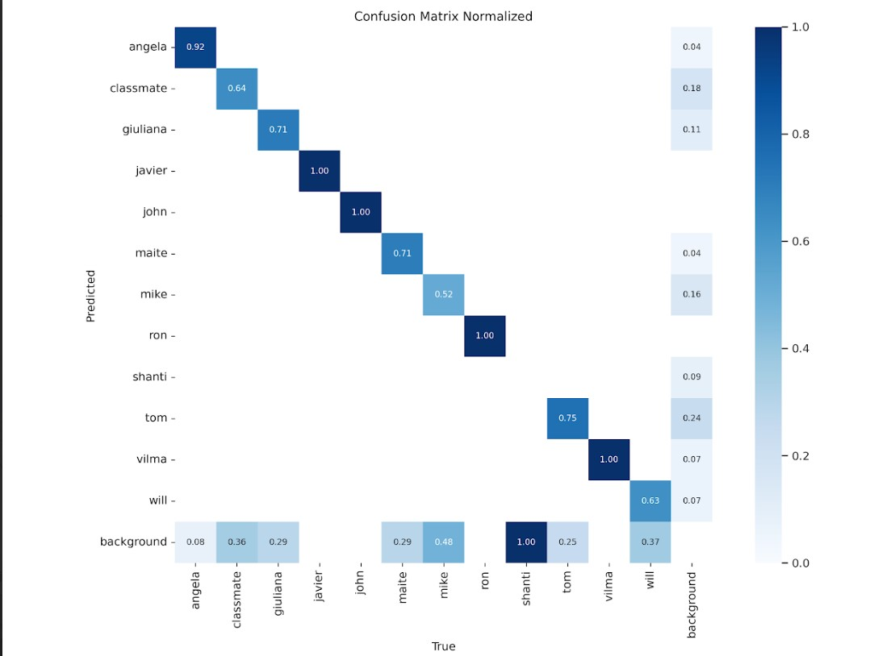
  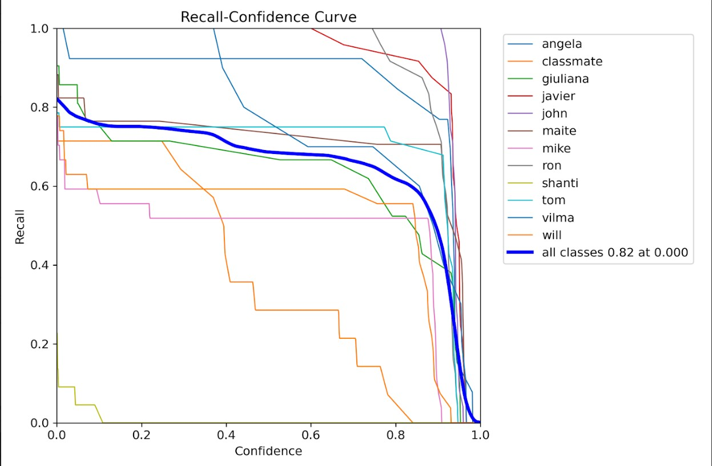
  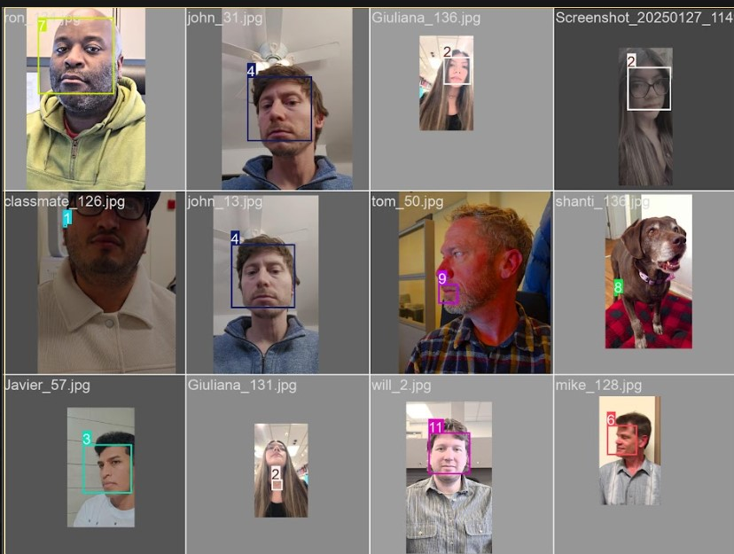
  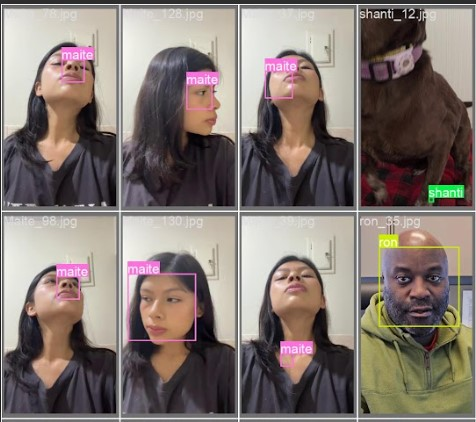
    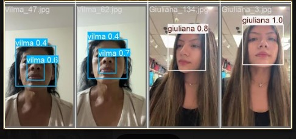
