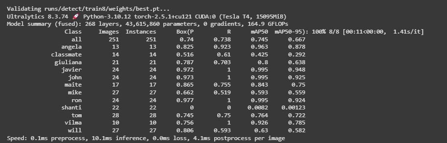

# Live Member Face Recognition
## Project Description
This project was inspired by my experience waiting in long lines to have my season pass scanned at a ski resort. I realized there had to be a more efficient way to verify memberships and grant access to members without unnecessary delays. The same issue exists in places like Costco, sporting events, and other venues where long queues form just to validate entry credentials.


## Project Proposal
To solve this problem, I developed a real-time face recognition system using computer vision. <br>
The goal is to eliminate long wait times by allowing members to gain access seamlessly through facial recognition, reducing the need for manual verification. <br>

 <br>
<br>


### System Overview
This system leverages sqlite to develop a members database, OpenCV, Ultralytics' for YOLO for object detection, and LBPHFaceRecognizer for real-time face recognition.<br>
By implementing this solution, venues such as ski resorts, retail stores, and stadiums can enhance customer experience by providing frictionless, secure, and efficient entry for their members.
### Table of Contents  
- [Setting up the SQLite Database](#setting-up-the-sqlite-database)  
- [Acquiring Video & Splitting Videos into Still Images](#acquiring-video--splitting-videos-into-still-images)  
- [Building YOLO Model](#building-yolo-model)  
- [Building LBPHFaceRecognizer](#building-lbphfacerecognizer)
- [File Information](#File-Information)
- [Future Implementations](#future-implementations)  
### Setting up the SQLite Database
Before creating the SQLite database, I needed to gather volunteers for my LMFR project.<br>
After reaching out to friends and family, I enlisted 12 volunteers, each assigned a unique ID.
##### Member List  

| Name      | ID Number |
|-----------|----------|
| Angela    | 1        |
| Classmate | 2        |
| Giuliana  | 3        |
| Javier    | 4        |
| John      | 5        |
| Maite     | 6        |
| Mike      | 7        |
| Ron       | 8        |
| Shanti    | 9        |
| Tom       | 10       |
| Vilma     | 11       |
| Will      | 12       |
#### Storing Data
For each volunteer, I generated synthetic data to store 15 different demographic attributes. <br> This data was randomly created and represents the type of information that potential members might have.
The Members database consisted of the following:
### Members Database

| Column           | Column Type         |
|------------------|---------------------|
| id               | INTEGER PRIMARY KEY |
| name             | TEXT                |
| age              | INTEGER             |
| date_of_birth    | TEXT                |
| address          | TEXT                |
| loyalty          | INTEGER             |
| member_since     | TEXT                |
| gender           | TEXT                |
| email            | TEXT                |
| phone_number     | TEXT                |
| membership_type  | TEXT                |
| status           | TEXT                |
| occupation       | TEXT                |
| interest         | TEXT                |
| marital_status   | TEXT                |
### SQlite Database Format

### Acquiring Video & Splitting Videos into Still Images 
I asked all 12 of my volunteers to send me an approximately 30-second video of their face. <br>
I suggested that they capture a variety of angles to help the YOLO and LBPH FaceRecognizer models to learn different aspects of their facial features.<br>
For example, the video should include their face looking directly at the camera, as well as other angles.
[](images/johns.mp4)
#### Extracting Frames from Video
I wrote Python code to extract approximately 100 images from each volunteer's video. Each volunteer's images were stored in a separate folder, with each folder containing unique, randomly selected frames.


<br>
### Model Comparison
| Feature                     | YOLO (You Only Look Once) | LBPH (Local Binary Patterns Histograms) |
|-----------------------------|--------------------------|----------------------------------------|
| **Model Type**              | Deep Learning (CNN-based) | Traditional Machine Learning |
| **Detection Approach**      | Object detection (detects multiple faces at once) | Face recognition (compares features of detected faces) |
| **Training Data Requirement** | Requires large datasets for training | Requires smaller datasets, can be trained with fewer images |
| **Speed**                   | Faster (real-time performance) | Slower (compares each face to a database) |
| **Accuracy**                | High accuracy for detection, but recognition depends on model training | Good for small datasets, but struggles with variations in lighting and angles |
| **Computational Power**      | Requires GPU for optimal performance | Works well on CPU, lightweight |

### Building YOLO Model 
To prepare the images for the YOLO v8 object detection model, I used OpenCV to detect faces within the images. Specifically, I employed the Haar Cascade classifier with the haarcascade_frontalface , an algorithm widely used for object detection, especially for faces. Once a face was detected, I generated a `.txt` file containing the volunteer's ID, the `x_center`, `y_center`, `width`, and `height` of the detected face.

I created a Python function that:

- Splits the images into training, validation, and test sets according to specified split ratios.
- Generates YOLO-formatted `.txt` annotation files for each image by detecting faces.
- Copies both the images and annotation files into their corresponding output folders.
- Finaly, data.yaml file linked the path,train,validation, number_of_classes

The folder structure for the output is as follows:
```bash
output_base/
    ├── train/
    │   ├── images/
    │   └── labels/
    ├── valid/
    │   ├── images/
    │   └── labels/
    └── test/
        ├── images/
        └── labels/

        
```
# Dataset Paths and Configuration
```yaml
path: /content/drive/MyDrive/capstone project/my_data_split
train: /content/drive/MyDrive/capstone project/my_data_split/train/images
val: /content/drive/MyDrive/capstone project/my_data_split/val/images
test: /content/drive/MyDrive/capstone project/my_data_split/test/images
nc: 12
names: ['angela', 'classmate', 'giuliana', 'javier', 'john', 'maite', 'mike', 'ron', 'shanti', 'tom', 'vilma', 'will']
```

### Building the YOLO Model
I used the Ultralytics package to build the Yolo v8 model <br>
`!yolo task=detect mode=train model=yolov8l.pt data="/content/drive/MyDrive/capstone project/data.yaml" epochs=50 imgsz=640`

- Overall Model Performance
* mAP@50: 74.5% → On average, the Yolo v8 model detects objects correctly 74.5% of the time at an IoU threshold of 0.50.
* mAP@50-95: 66.7% → A more stringent metric, showing performance across multiple IoU thresholds.
* Precision (P): 0.74 → Out of all detected objects, 74% were correctly classified.
* Recall (R): 0.738 → The model correctly detected 73.8% of the total ground truth instances.

## Strongly Performing Classes

- **Javier, John, Ron**:  
  They have near-perfect precision and recall, meaning they are detected correctly almost all the time.

- **Angela, Giuliana, Maite, Vilma**:  
  These classes also show strong performance with high recall and mAP scores.

## Weakly Performing Classes

- **Shanti (P: 0, R: 0, mAP@50: 0.0082)**:  
  model is failing to detect this class altogether.

- **Classmate (mAP@50: 0.425, P: 0.516, R: 0.61)**:  
  Struggles with precision and recall, meaning many false positives and false negatives.

## Moderate Performance

- **Mike, Tom, Will**:  
  These classes have mid-range scores, suggesting inconsistency in detection. <br>

### Confusion Matrix & ROC Curve

##### Confusion Matrix Results
- **Strong diagonal values** indicate good classification accuracy.
- **Misclassifications**:
  - **Classmate (0.64)** shows some misclassified instances.
  - **Background** overlaps with other classes, confusing faces with non-faces.

### ROC Curve & Recall-Confidence Analysis

- **Recall at 0.0 confidence**: Detecting 82% of positive instances.
- **As confidence increases**, recall sharply drops around 0.8–1.0.
- **Some classes perform better** than others:
  - **Classmate and Will** show a steep decline, indicating they are more affected by confidence filtering.
  - Other classes maintain high recall across confidence thresholds.

  
  
    

### YOLO v8 Model Testing Results

The YOLO v8 model performed well on several test videos, accurately predicting the **volunteers** by drawing a boundary box with high confidence around their faces.

However, in some test videos, the model **misclassified** certain volunteers. 


<br>
<br>
### building-lbphfacerecognizer
The Second Model I used was the LBPH Face Recognizer<br>
Again I used the haarcascade_frontalface to detect faces and once a face was detected I saved these images into a training folder
 
Next, I used the LBPH Face Recognizer to train a Face Recognizer Model 
 
 <br>
 Once the model was trained I created a function in sql to get the profile information of each member and when the LBPH Face Recognizer  makes a prediction on a user id I displayed that image via webcam or a video to predict on
 
  
  Though this model was slower than the yolo model and also suffered from false predictions
  
  <br>
  
  <br>
  ### File-Information
## 📁 Project Structure  

### 🎥 Videos  
- **videos/** – Folder containing volunteer videos, used for extracting images.  

### 🖼️ Images  
- **images/** – Folder used for the README section.  

### 🗃️ Database Scripts  
- **create_members_table.py** – Creates the `members` table in SQLite.  
- **abillity_to_edit_members.py** – Allows editing of the `members` table.  
- **create_fields.py** – Script for generating member data.  

### 📷 Image Processing  
- **extract_images_from_video.ipynb** – Function to extract images from videos.  

### 🏗️ Data Preparation  
- **build_yolo_data.ipynb** – Prepares data for YOLO v8 model.  
- **data (1).yaml** – YAML file specifying class names and locations for training, validation, and test data.  

### 🤖 YOLO Model  
- **yolo_large_model.ipynb** – Script for training the final YOLO model.  
- **best.pt** – Trained YOLO model weights for face recognition.  

### 🎯 YOLO Predictions  
- **capston_yolo_finished_color_box.py** – Webcam-based YOLO model for member and color recognition using bounding boxes.  
- **caspstone_yolo_finsihed_video_color_box.py** – Processes videos, applies YOLO predictions, and optionally rotates videos before writing output.  

### 📊 LBPH Model  
- **final_use_process_video_for_model.py** – Prepares data for LBPH model (requires a dedicated storage folder).  
- **used_to_build_model.py** – Script for training the LBPH model (requires a folder to store `.yaml` results).  
- **capston_lbh_model_color_box.py** – Uses LBPH model to make predictions via webcam.  
- **capston_lbh_model_write_out_video.py** – Applies LBPH model predictions to videos and writes output.  

### 🔄 Model Deployment  
- **jm_full_models.py** – JMModels class for making predictions using either YOLO or LBPH, supporting webcam and video input.
<br>

### future-implementations


#### Streamlit App  
- Build a Streamlit app where a user can either use a webcam or upload a video for model predictions.  
- In the Streamlit app, create a sales dashboard that is tied to a user.  
- Incorporate another model to analyze user emotions—this could be useful in detecting the user’s mood while shopping.  

  

#### Build App  
- Build an app using Kivy or another framework.  
- Connect a webcam to an app that allows a person to see their member status in real-time.  
- Develop for production use, enabling employees to verify members in real-time.  

  

[Image created By Ingo Joseph found on Pexels.com](https://www.pexels.com/photo/person-using-google-maps-application-through-black-android-smartphone-35969/)  

### Improve Predictions with More Sophisticated Models  
* Improve Face Recognition model using more Sophisticated Models
* Better Model can help with reducing false predictions


